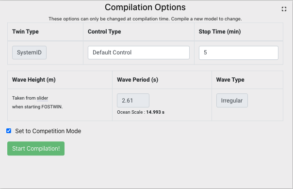

# FOSTWIN Digital Twin <!-- omit in toc -->

- [Overview](#overview)
- [Control competition](#control-competition)
- [Model outline](#model-outline)
- [Running the FOSTWIN locally](#running-the-fostwin-locally)
- [Using the web interface](#using-the-web-interface)

# Overview
In a joint effort between [Sandia National Labs (SNL)](https://energy.sandia.gov/foswec-testing-helps-validate-open-source-modeling-code/), [Oregon State University (OSU)](https://wave.oregonstate.edu/), and [Evergreen Innovations (EGI)](https://www.evergreeninnovations.co), we present this open source repository to interact with a digital twin of the Floating Oscillating Surge Wave Energy Device (FOSWEC). This repository is complemented by a web interface that gives simple and convenient access to the tools provided here. A video tutorial of how to use this web interface can be found [here](https://digitalops.sandia.gov/Mediasite/Play/5ac7786567ef4e7fa6f77b385a2781ef1d). 

If you would like more information about the FOSWEC device please check out the following resources.
- https://dx.doi.org/10.15473/1782587
- https://doi.org/10.1016/j.energy.2021.122485

From here onwards, we will refer to the digital twin of the FOSWEC as the FOSTWIN.

# Control competition
For information on an exciting FOSTWIN control competition opportunity, please take a look [here](https://pmec-osu.github.io/FOSTWIN/).

# Model outline

## Model Versions

The remote system is running Matlab & Simulink version **r2022a**.  Any uploaded controller that exceed this version will not be able to compile. If you're running r2022b on your machine, you can save your model under the r2022a release with the following steps:

1. Load your model in r2022b
2. Select Save > Export Model to > Previous Version (r2022a)
3. Upload the r2022a version saved in previous step.

## Top Level Model

There are two digital twin models of the FOSWEC to choose from:  
- The first is based on the open source code [WEC-Sim](https://wec-sim.github.io/WEC-Sim/master/index.html).  
- The second is a system identification model based on experimental data collected from the actual FOSWEC device during a test campaign at OSU detailed [here](https://dx.doi.org/10.15473/1782587).  Further information from this test campaign can be found in the paper located [here](https://doi.org/10.1016/j.energy.2021.122485).

Each version of the digital twin includes a plant model and a control model. The plant model is intended to be fixed, however the control model is meant to be experimented with. There is a default control model to get started with. This model can easily be replaced with a custom control model by the user.

The top level model is where the power absorption controller and the plant models are joined:

## WEC-Sim model

The WEC-Sim model uses a simplified geometry and WAMIT output to provide a time domain model of the FOSWEC. The simulation is set up to replicate the test conditions experienced during testing at the O.H. Hinsdale Wave Research Laboratory. This includes matching the water depth and mooring, which was a taut system.

## System identification model

The system identification model is based on experimental test data collected by the FOSWEC at the O.H. Hinsdale Wave Research Laboratory. System identification techniques from MATLAB were used to establish a multiple input multiple output (MIMO) admittance model of the system. The motor torque is the input, and the motor position is the output.

The wave input for the SID model is created by taking the wave characteristics and using the results from WAMIT to create an excitation force input for the model.

## Absorption controller

The absorption controller computes a forcing demand to extract wave power from the device. We have provided a `defaultCtrlModel` that creates a simple velocity proportional damping control system. This model will be helpful to get familiar with using the controller inputs (aft and bow flap positions), the control parameters, and the outputs for logging data signals. 

To develop a custom controller, we recommend that you start with the controller template model `ctrlStarter.slx`. The `ctrlStarter.slx` model has no actual control built in, but defines all relevant controller input and output bus structures. This includes up to four parameters that can be tuned live via the web interface. If your controller does not have any (or fewer than four) tunable parameters, simply terminate the unused parameters.

## Tunable control parameters

The web interface (see description below) allows some control parameters to be changed while the model is running on a real-time Speedgoat system. An example of tunable parameters are the aft and bow damping applied in the `defaultCtrlModel`, which are mapped to ctrlParam1 and ctrlParam2. By varying these parameters, one can manipulate the damping force applied to the motor as the simulation is running. This feature can be used to develop a first quick sense for where the optimum damping values may lie. 

## Control signals 

On the right-hand side of the `defaultCtrlModel` and `ctrlStarter` models, you will see that there are always 2 outputs. One of these output busses is essential for the interaction between the controller and the twin, containing the motor current setpoints `curAft` and `curBow`. The second output bus is used for logging and sending data to the charts on the web interface.

There is no requirement to make use of the extra `ctrlSignals` output bus; these signals are informational only. However, this bus must still exist to successfully compile the controller when running via the web interface. The four bus signals are returned in the full resolution data, and populate the very bottom chart on the web interface. If you are not using all four informational control signals, we recommend wiring a constant 0 block to suppress Simulink warnings.

## Power signs

Mechanical power absorbed from the waves is associated with a negative sign. Electrical losses (I2R) are always positive. The net power is the sum of the mechanical power absorbed and the I2R losses. A negative net power means net power is being absorbed from the waves. A positive net power means the I2R losses outweigh the absorbed wave power. For the [FOSTWIN control competition](https://pmec-osu.github.io/FOSTWIN/), optimizing net power means obtaining a **maximum negative value** of the net power mean over the sea state.

## Supervisory controller

The model contains a supervisory state machine. This state machine ensures that maximum current constraints are not violated and catches controller instabilities.

There are 6 states in this state machine:
1. Undefined - a non-state to handle edge cases
2. Init - starting point 
3. Normal - main absorption controller operating without issues
4. Stabilizing - stabilize the system after an excessive motor current
5. Safe Damping - safe condition, where the absorption control is taken over by a default (and known to be stable) damping controller
6. Fault - absorption controller deactivated

The state machine operation is shown in the Simulink State Flow chart below. The system generally remains in the Normal state, unless a large motor current signal is detected. This detection is based on a low-pass filtered version of the instantaneous current, such that a short current spike does not trigger an error condition. If an excessive current signal is detected, the state machine seeks to stabilize the system and return to the Normal operating state. Continued violation of the motor current limit will trigger the Fault state, where the absorption controller remains deactivated.

## Wave types

There are provisions for running regular and irregular wave conditions. Irregular waves have a JONSWAP spectrum input.

## Aft vs Bow

The bow flap is the one facing the incoming waves first.

# Running the FOSTWIN locally
To run the FOSTWIN locally, follow these steps:
1. Clone the FOSTWIN repository [here](https://github.com/PMEC-OSU/FOSTWIN) (this repo).
2. (Optional, for WecSim only - you can skip this step for the SID version):  
   1. Install version 5.0 of [WEC-Sim](https://github.com/WEC-Sim/WEC-Sim/releases). This is the only version currently supported.
3. Modify `initModels_GUI.m` in the FOSTWIN repository as desired:
   - Choose simulation type either `NonRealTime` or `SingleSpeedgoat`
   - Set wave height and wave periods for your simulation
   - Set initial values for inputs to your control model
   - Set simulation stop time
   - Set wave type of `regular` or `irregular`
   - Specify the control model name
   - Choose either the `WECSim` or `systemID` TWIN model
   - If using a Speedgoat for realtime simulation, set the name of your target device
   - (Additional step for WecSim version only): 
     - Change `wecSimPath` near the top of the `initModels_GUI` script to reflect the source directory of your installed WEC-Sim installation
     - When running WECSim as the twin for the first time locally, uncomment the `modifyWECSim_Lib_Frames` line of the `initModels_GUI` script.
4. Run `initModels_GUI.m` to get started
5. Results of the simulation are saved to simulation-data.mat in the non-realtime environment.

# Using the web interface

The FOSTWIN web interface allows developers to test their control code on a real-time system. Via our web interface, you can gain access to a Speedgoat real-time target machine, which can execute compiled Simulink code for control applications.

## Signing up

Signup instructions for the web interface are provided [here](https://pmec-osu.github.io/FOSTWIN/). 

## Scheduling time

After signing up, you are first presented with a dashboard to select dates to use the system.  When you select a given date, you have reserved that date from 00:00:00 -> 23:59:59 in `US/Central` time (Midnight to Midnight).

1. When your time slot begins (at midnight of your chosen date), the "To FOSTWIN Dashboard" button in the scheduling dashboard will become enabled. Clicking this button takes you to the web interface described in the following sub-sections.  
2. Around 10 minutes before your time slot ends, an alert will be raised from the web interface. At this point, you should stop your simulation and download your data.
3. Around 5 minutes before your time slot ends, the system will automatically stop and reset itself. Any non-saved simulation data will be lost.
4. Once your time slot has ended, you will be redirected to the date selection dashboard where you can reserve additional time slots.
   
**Note**: When your turn arrives, the `STATUS` box in the middle of the FOSTWIN dashboard (with TET and Speedgoat info underneath) should say `System Not In Use`. If this is not the case, please press the `Finished With System` button to reset the system.  

## Compilation

Compilation invokes a range of Simulink real-time tools. Simulink code is first translated into C/C++ code. This C/C++ code is then compiled to form an executable that can be run on the Speedgoat real-time target.

The options shown in the below box are all parameters that cannot be changed without recompiling. To change any of these options, stop your running simulation, and then press the `Start Compilation!` button. As the project compiles, the Compilation Report box directly to the right of the options will start to output compilation information. Depending on the length of simulation requested, this compilation could take a few minutes.

Once compilation is complete (as confirmed at the end of the compilation report), the system is ready to be started.

Checking the `Set To Competition Mode` box changes the `Twin Type` to `SystemID`, and sets the wave conditions as defined in the FOSTWIN control competition rules [here](https://pmec-osu.github.io/FOSTWIN/).

## Control parameters

When `Start FOSTWIN` is pressed, the initial values for the control parameters will be taken from the relevant sliders. Our default controller uses two control parameters, the aft and the bow damping. "Param3" and "Param4" are not used for this default controller, but are available for use in custom controllers. 

## Wave height

When the twin type is `SystemID`, you can change the wave height while the simulation is running. When the twin type is `WECSim`, the wave height is fixed to the value chosen at compile time. This limitation is due to the way in which the wave excitation force is calculated within `WECSim`. 

## Custom controller model upload

To upload a custom controller model, select the desired model file in the explorer and then click upload. Only .slx files are allowed. When uploading a new model, please make sure that no model is currently running or compiling. If you do not yet have a custom control model, you can simply select Default Control in the [Compilation Options](#compilation). 

## System control buttons
These buttons control the overall system behavior, with details given below.

### Modify control display (**optional**)

The Modify Control Display button gives you the following options:

This dialog allows for some UI customization, to reflect your custom controller and input option type. The Signal names across the top row update the labels on the very bottom chart in the UI. This bottom UI chart is configured to show data set up as outputs in your control model. 

The Param options for the rest of the dialog box are for setting names, ranges (min, max, step), and types for the control options.  These are pre-populated with realistic ranges and correct names if "Default Control" is selected in the compilation options. The Type is either a range (slider) or a spinner (a numeric input with up and down arrows to increment the value). The spinner updates the param when "set param" button is pressed. The sliders update the param when the slider is released.

Pressing the "Update" button will save your changes and refresh the main page.

### Start/ Stop FOSTWIN

These buttons start and stop the realtime simulation on the Speedgoat real-time. The Stop button allows you to terminate the simulation before the allocated run time. Note that you can only prepare and download data once the simulation is stopped, either after the full run time, or after the Stop button was pressed.

### Prepare & Download Data (and data definitions)

Pressing this button prepares high temporal resolution (1 kHz for SID) data for subsequent post processing. For long simulation times, this data preparation step may take a few minutes. Once complete, a .mat file will be available in your downloads.

The logged data includes:
- Power
  - `powerMechAft`, mechanical power generated on aft flap
  - `powerMechBow`, mechanical power generated on bow flap
  - `powerMechTotal`, sum of the aft and bow mechanical powers
  - `powerMechAvg`, moving average of total mechanical power. Irregular waves are calculated across 60 waves, and regular are calculated across 5 waves. 
  - `powerI2R`, I2R loss
  - `powerNet`, defined as `powerMechTotal` - `powerI2R`
  - `powerNetMean`, running mean of `powerNet`. At the end of the simulation, the last value is the mean calculated across the simulation duration.
  - `powerNetMovingAverage`, moving average of `powerNet`. Irregular waves are calculated across 60 waves, and regular are calculated across 5 waves.
- Conditions
  - `wave`, height (H) and period (T) of the waves simulated
  - `waveType`, regular or irregular
  - `Ts`, the rate at which the Speedgoat executes every step.
  - `simulationType`, SingleSpeedgoat or NonRealtime
- Control Signals
  - `Aft`, Position and current (signals passed between controller and twin)
  - `Bow`, Position and current (signals passed between controller and twin)
  - `ctrlSignals`, 1 through 4 for the 4 custom outputs of the control model (default or custom upload)
  - `ctrlParams`, 1 through 4 for the 4 custom inputs of the control model (default or custom upload)
  - `state`, State values from supervisory state machine
  - `waveH_rt`, waveH values across simulation. Can be changed in realtime mode with `systemID` twin

When running locally, the more detailed output from WECsim is also available, and will be included under a `WECSim` key in the logged data object.  When running through the web interface, only the above signals are available.

Both Power and Control Signals data have one point for every time step of the simulation, while the conditions are constant values defined at the start of the simulation.

### Finished with system

This button only needs to be pressed once when you are ready to sign out of the system. This button resets the remote host machine to be ready for the next user. Note that this button clears all data from the host machine, including any simulation data you have not yet downloaded.

## Ocean Scale

We have used an indicative scale of 1:33 to scale up the tank-scale wave parameters. This may be helpful for developers more familiar with ocean-scale design values. These ocean-scale values are not used anywhere in the simulation and are for guidance only. 

## Browser support

We recommend using Google chrome for best performance. If it is difficult to see everything inside of the boxes in the web interface, please zoom out to improve the visual quality. 

