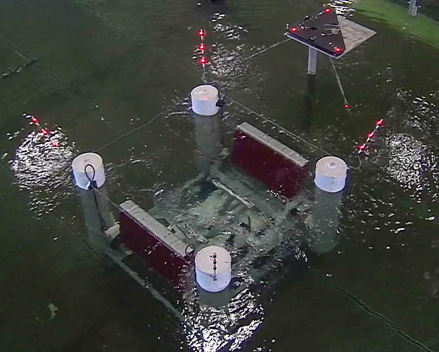

# FOSTWIN Digital Twin



- [FOSTWIN Digital Twin](#fostwin-digital-twin)
- [Getting Started](#getting-started)
  - [Purpose](#purpose)
      - [New Users](#new-users)
      - [Experienced Users](#experienced-users)
- [Using the Web Interface](#using-the-web-interface)
  - [Compilation](#compilation)
  - [Control Parameters](#control-parameters)
    - [Wave Height](#wave-height)
  - [Model Upload](#model-upload)
  - [System Control Buttons](#system-control-buttons)
    - [Edit Control Display](#edit-control-display)
    - [Start/ Stop FOSTWIN](#start-stop-fostwin)
    - [Prepare & Download Data (and data definitions)](#prepare--download-data-and-data-definitions)
    - [Finished With System](#finished-with-system)
- [Developing A Controller](#developing-a-controller)
  - [Control Parameters](#control-parameters-1)
  - [Control Signals](#control-signals)
- [Top Level Model](#top-level-model)
  


# Getting Started
## Purpose

In a joint effort between [Sandia National Labs (SNL)](https://energy.sandia.gov/foswec-testing-helps-validate-open-source-modeling-code/), [Oregon State University (OSU)](https://wave.oregonstate.edu/), and [Evergreen Innovations (EGI)](https://www.evergreeninnovations.co/speedgoat-simulink-rt-services/), we present this open source repository and a web based platform allowing MATLAB & Simulink developers to interact with a Digital Twin of a Floating Oscillating Surge Wave Energy Device (FOSWEC).  Information about the FOSWEC device being simulated in the Digital Twins included in this repo and the web interface can be found [here](./DigitalTwins.md).

The web based platform aims to serve a mix of different users with varying experience and dynamics modeling skill levels, from someone who wants to get familiar with realtime Digital Twin simulations to someone who has access to the realtime Simulink toolboxes and wants to test their custom controller model but doesn't have the realtime [Speedgoat](https://www.speedgoat.com/speedgoat-solutions?utm_term=&utm_campaign=Dynamic+Ad+Groups&utm_source=adwords&utm_medium=ppc&hsa_acc=6520550235&hsa_cam=887795487&hsa_grp=43284490926&hsa_ad=208143357041&hsa_src=g&hsa_tgt=aud-387379185812:dsa-295317350131&hsa_kw=&hsa_mt=b&hsa_net=adwords&hsa_ver=3&gclid=EAIaIQobChMIiNj__c3F8wIVBQutBh1JvQioEAAYAiAAEgJZsfD_BwE) hardware.

#### New Users

If you're someone who is wanting to get familiar with the idea of realtime simulations, FOSWEC's, and digital twins, read the section [below](#using-the-web-interface), skip the model upload, and select **Default Control** in the compilation option box in the web UI.  We'd also recommend you read through [this](./DigitalTwins.md) readme to get a baseline understanding about what's happening in the digital twins.

#### Experienced Users

If you're up to speed with the web interface and are ready to work on developing your own Controller model, we recommend you skip to to [Developing A Controller](#developing-a-controller) & read [this](./DigitalTwins.md) digital twin readme.  

# Using the Web Interface

## Compilation


The options shown in this box are all parameters in the models that cannot be changed without recompiling the code that is executed on the speedgoat hardware.  In order to change any of these options, you must stop any running simulation, then press the `Start Compilation!` button. You will first be met with a success/ failure message that will pop up in the compilation options box (pictured above), then as the project compiles the Compilation Report box directly to the right of the options will start to output information about the options selected, then information about the compilation itself. 

**COMPILATION COMPLETE WILL BE RENDERED AT THE END OF THE COMPILATION REPORT INDICATING THE SYSTEM IS READY TO BE STARTED**

## Control Parameters


**WHEN "START FOSTWIN" IS PRESSED, THE INITIAL VALUES FOR THE CONTROL PARAMETER VALUES ARE TAKEN FROM THESE SLIDERS**

The `Default Control` option built into the system has the ability to change the damping forces that are applied to the simulated motor torque shafts *while* the simulation is running, this is a unique benefit to running a simulation in realtime. 

While these values are able to be changed in realtime, when you start a simulation, these values need to be initialized to some starting value.  When you press the `Start FOSTWIN` button, the values shown on the sliders (or spinners) are set as the starting values for the Aft and Bow Damping.  **There is absolutely no requirement to change parameters during a simulation but it's available if you want to!**

You'll likely note that "Param3" and "Param4" don't have a unique name and are set to 0 by default, this is because we've built the system to allow for a custom controller to be uploaded into the system, where it could also have parameters that can be changed during the running simulation.  We currently allow for four input parameters to the controller model, again with no requirement to use them, so these "Param3" and "Param4" sliders have no effect on the Default Control model, but are there to allow for the ability to control models with more complex input parameters.  More information about the control parameters and uploading a custom controller is [here](#developing-a-controller).

### Wave Height

When switching between `WECSim` and `SystemID` in the Twin Type option in the compilation options box, you'll likely note the Wave Height selector in compilation disappears and a new slider becomes un-blurred when `SystemID` is selected.  This is due to the way that the waves are pre-calculated and routed into the system when using the `SystemID` twin.  

When `SystemID` is the compiled twin, the wave height slider is used like the other sliders to set the initial value for the wave height when pressing the `Start FOSTWIN` button.  With `SystemID`, you have the ability to change the wave height during the simulation to see how the twin and controller react to different wave conditions.  

This is currently available for the `SystemID` twin only.  We plan to incorporate a similar functionality (changing wave height without re-compiling) for `WECSim`, but it's available in the `SystemID` twin because the wave excitation forces are pre-calculated (linear calculations) and we can multiply the excitation forces by the set wave height (in slider) at each step in the simulation to dynamically change the magnitude of the excitation forces sent into the digital twin.

More info on the twins [here](./DigitalTwins.md)


## Model Upload


This section of the dashboard is pretty simple, if you have a custom controller you want to upload, select the file in the explorer that opens and click upload!

If you want to upload a secondary model, just make sure you've either pressed the "Stop FOSTWIN" button or that the simulation has automatically stopped due to stop time, that you're not currently compiling any models, and you're ready to upload a new model.  **Only .slx files are allowed**

**NOTE: If you don't have a model to upload, don't fret!  Use Default Control in the [Compilation Options](#compilation) box**


## System Control Buttons


### Edit Control Display


Wen you click the "Edit Control Display" button, you'll be met with the options above.  The purpose here is to make the UI reflect your custom controller.  The Signal names across the top row will update the labels on the very bottom chart on in the UI.  This chart is configured to show any data set up in your uploaded control model that is sent to one of the four available outputs.  This is simply to improve your experience and can be totally skipped if you're fine with the shown names.  

The Param options for the rest of the dialogue box are just for setting names, ranges, and types for the control options.  We have it pre-populated with realistic ranges and correct names if "Default Control" is selected in the compilation options.  The Type is either a range (slider) or a spinner (a numeric input with up and down arrows to increment the value).  

**The primary difference between range and spinner is a spinner sends the param when "set param" button is pressed, and the sliders set the param and send it to the speedgoat when the slider is released.**

**Pressing "Update" button will refresh the page.**

### Start/ Stop FOSTWIN

These buttons start and stop the realtime simulation.  At the matlab prompt, they're equivalent to running `target.start` and `target.stop` where target is your simulink realtime device (Speedgoat).  

Stop isn't always required, since we set a stop time in the compilation options, if the simulation runs for that duration before you press the stop button, the simulation will automatically stop.  This is mostly important for collecting your simulation data at the end of your time on the system.  If you're done with your simulation before the set stop time, then the ability to prepare and download data will fail until you've stopped the simulation.  If you're interested, this is because the realtime data logging happens on the Speedgoat hardware itself, then when a simulation is finished (either by stop time or manually stopping the simulation), the Speedgoat uses it's connection to the host pc to transfer over the logged data.  The data on the host machine is what is returned to you.

### Prepare & Download Data (and data definitions)

If you've ran a long simulation (> 30 minutes) please be patient!  When you click the Prepare & Download Data button, the logsout variable in the matlab workspace is re-formatted into a `.mat` file, uploaded to a custom server, then transferred to your browser to download.  Take a look at the [Top Level Model](#top-level-model) to help understand the data logging.  

Data Logged:
- Power
  - Aft_Power - power generated on aft flap
  - Bow_Power - power generated on bow flap
  - Total_Power - sum of the aft and bow power
  - Avg Power - Moving average of total power.  Moving average calculated based off wave type selected.  Irregular waves are calculated across 60 waves, and regular are calculated across 5 waves.  
- Conditions
  - wave - height (H) and period (T) of the waves simulated
  - waveType - type of wave selected
  - Ts - time step - the rate at witch the speedgoat executes every step in the differential equation that makes up these models.  Either 1/1000 (1ms per loop or 1000hz) or 1/100 when using WECSim digital twin and Irregular (JONSWAP) wave spectrum.
- Control Signals
  - Aft - Position and Current (signals passed between ctrl and twin)
  - Bow - Position and Current (signals passed between ctrl and twin)
  - Control_Signals - 1 through 4 for the 4 custom outports of the control model (default or custom upload)
  - Control_Params - 1 through 4 for the 4 custom inports of the control model (default or custom upload)
  - Capture Width - Energy Flux is calculated before starting the simulation for the maximum available energy in the waves being simulated.  Then at every time step, the Energy Flux is multiplied by the squared wave height to then divide the Avg Power by.  Shown graphically in bottom right of the [Top Level Model](#top-level-model).


Both Power and Control Signals data have one point for every time step of the simulation, while the conditions are static values with only one entry.

**PLEASE NOTE: PRESSING FINISHED BUTTON CLEARS ALL DATA FROM HOST MACHINE.  DON'T PRESS FINISHED UNTIL YOUR DATA IS DOWNLOADED IF YOU WANT TO USE IT**


### Finished With System
This button only needs to be pressed once when you're ready to sign out of the system.  This button essentially resets things on the host machine to be ready for a next user.  

**PLEASE NOTE: PRESSING FINISHED BUTTON CLEARS ALL DATA FROM HOST MACHINE.  DON'T PRESS FINISHED UNTIL YOUR DATA IS DOWNLOADED IF YOU WANT TO USE IT**


# Developing A Controller

To develop a controller for the FOSTWIN digital twin, we've included a nearly blank model called `CONTROLLER_STARTER.slx`, that we highly recommend you start out with (also feel free to start with the provided `defaultCtrlModel`).  This nearly blank controller simply has the required inports and outports to allow it to be dropped into the Top Level model. Without the correct number of inports and outports (as defined in the starter model), the uploaded control model will not be able to be used through the web platform. Here's what it looks like in Simulink:


As you can see, the starter has no actual control built in, further the position values from the flaps simulated in the digital twin are routed directly to the current output that is fed back into the digital twin model and wouldn't be good to use as is. If your controller doesn't have any parameters that would need to be updated when starting (or restarting) a simulation, or wouldn't need to be changed while the simulation is running, just terminate the inports and don't connect the outports to any wires in your controller model.  

We've also provided a `defaultCtrlModel` that creates a simple damping control system, this model may be helpful to examine to get familiar with using the inports for control parameters and outports for logging data signals. 


## Control Parameters

While there is absolutely no requirement to manually change parameters within the control model (default or the one you create), the web interface allows for changing control parameters (and wave height if using systemID as the twin) while the model is being ran on the [Speedgoat](https://www.speedgoat.com/speedgoat-solutions?utm_term=&utm_campaign=Dynamic+Ad+Groups&utm_source=adwords&utm_medium=ppc&hsa_acc=6520550235&hsa_cam=887795487&hsa_grp=43284490926&hsa_ad=208143357041&hsa_src=g&hsa_tgt=aud-387379185812:dsa-295317350131&hsa_kw=&hsa_mt=b&hsa_net=adwords&hsa_ver=3&gclid=EAIaIQobChMIiNj__c3F8wIVBQutBh1JvQioEAAYAiAAEgJZsfD_BwE) in a realtime simulation, so this version of the project allows the same behavior.  Looking at the `defaultCtrlModel` may help make this more clear.  In the image from above of the `defaultCtrlModel`, note that the inports (`Control_Param1` & `Control_Param2`) are routed into a multiplication block tied to the velocity calculated from the position data from the twin.  These multiplication blocks are a replacement for a gain block that would represent the damping force applied to the motor, and we can change this damping force while a simulation is running via changing the parameter fed into the control model.

Via the web platform, we have incorporated a UDP system that takes in the commands from the web UI, converts them from bytes to the appropriate data type, and feeds them into the control model selected (Default or an uploaded model you've created).  If you're running the model locally in non-realtime mode, the control parameters still need to be initialized the same way, however changing during runtime isn't available.  If you're running the model in a realtime environment on your own Speedgoat, we've provided a ```ctrl()``` matlab function that wraps the ```target.setparam()``` Simulink realtime functionality.  Here's an example of how to use it from the matlab prompt:

```C++
>> initModels_GUI
>> starttarget
>> ctrl('param1', 15)
>> ctrl('waveH', 2)
>> stoptarget 
...
```

If you'd prefer to run the command yourself, here is what the ```ctrl()``` function does (you'd run the pTg.setparam() line manually):

```C++
function [error] = ctrl(portName, value)
%CTRL - wrapper to set params while running a realtime simulation

error = "";
pTopModelName = evalin('base','pTopModelName');
pTg = evalin('base','pTg');
allowed_ports = ['param1' 'param2' 'param3' 'param4' 'waveH'];

if ismember(portName, allowed_ports) == 0
   error = sprintf('portName argument not accepted.\nExpected: param1, param2, param3, param4, waveH\nRecieved: %s', portName);
   return
end

try 
    pTg.setparam([pTopModelName, '/', portName], 'Value', value);
catch e
    error = e;
end

end
```


## Control Signals 

On the right side of the provided `defaultCtrlModel` and `CONTROL_STARTER`, you'll see that there are always 6 outports.  Two of witch are essential for the interaction between the controller and the twin - `ctrl2twin.Cur_Aft` and `ctrl2twin.Cur_Bow` (built into the starter models), and the other four being used for logging and sending data to the charts on the web interface.  

While there is no requirement to use these extra 4 outports on the control model, the must still exist to successfully compile the controller when running through the web interface.  These four outports are the `Control_Signals` returned in the full resolution data, and populate the very bottom chart on the web platform.  Using the [Edit Control Display](#edit-control-display) button, you can rename the signals on the chart to make interpreting the data easier.  

Just like the control parameters fed into your custom controller, if you don't have 4 signals to log for post analysis or to send up to the web platform for viewing during the simulation, just don't connect the outport(s) to any lines in your controller.  

You will see a warning in the compilation if you don't connect the required outports to any wires in your controller, this doesn't mean anything is wrong, just simulink telling us that the ports are essentially unused.  

# Top Level Model


