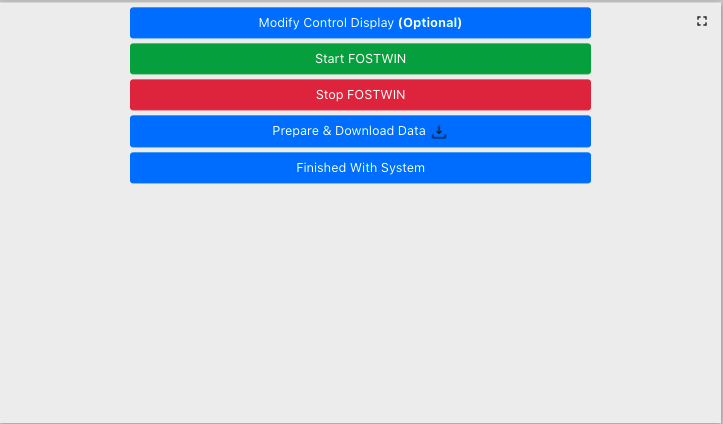

# FOSTWIN Digital Twin <!-- omit in toc -->


- [Competition](#competition)
  - [Rules](#rules)
  - [Scoring](#scoring)
- [Participate in Competition](#participate-in-competition)
  - [Scheduling times](#scheduling-times)
- [Getting Started](#getting-started)
  - [Purpose](#purpose)
      - [New Users](#new-users)
        - [Tutorials](#tutorials)
      - [Experienced Users](#experienced-users)
      - [Additional resources](#additional-resources)
- [Top Level Model](#top-level-model)
- [Running FOSTWIN locally](#running-fostwin-locally)
- [Developing A Controller](#developing-a-controller)
    - [Control Parameters](#control-parameters)
    - [Control Signals](#control-signals)
  - [Controller State](#controller-state)
- [Web Interface](#web-interface)
    - [Ocean Scale](#ocean-scale)
    - [Power Signs](#power-signs)
    - [Compilation](#compilation)
    - [Control Parameters](#control-parameters-1)
      - [Wave Height](#wave-height)
    - [Model Upload](#model-upload)
    - [System Control Buttons](#system-control-buttons)
      - [Modify Control Display (**Optional**)](#modify-control-display-optional)
      - [Start/ Stop FOSTWIN](#start-stop-fostwin)
      - [Prepare & Download Data (and data definitions)](#prepare--download-data-and-data-definitions)
        - [Aft vs Bow?](#aft-vs-bow)
      - [Finished With System](#finished-with-system)
- [Digital Twin Description](#digital-twin-description)
    - [Interaction](#interaction)
    - [Model types](#model-types)
    - [Model overview](#model-overview)
    - [Wave types](#wave-types)
  - [Control Model](#control-model)
    - [Inputs and outputs](#inputs-and-outputs)
    - [Default control model](#default-control-model)
    - [Starter control model](#starter-control-model)
  - [WEC-Sim model](#wec-sim-model)
  - [System identification model](#system-identification-model)


# Competition

For more info on the timeline of the competition and the reward, checkout the page [here](https://pmec-osu.github.io/FOSTWIN/).

## Rules
- SystemID (SID - System Identification) Digital Twin Model only - not WECSim
- Must use provided admittance (including drive train)
- No changes to be made outside of the control model (FOSTWIN/ctrl/userCtrlModel block)
- Must be able to run in realtime at 1kHz loop rate on Speegoat Baseline target machine
- Optimize net (mechanical - I2R loss) power capture for sea state with Hs of 0.136 m and Tp of 2.61s for 300s simulation time
- Irregular waves seeded with 'default' for the random number generator must be used.  In scoring, we'll evaluate with 5 additional seeds unknown to the developer

## Scoring

Following scoring criteria will be evaluated in the order listed, where the subsequent criteria will only be used to determine the winner if there are ties.

1. Mean of net (mechanical - I2R loss) power across the sea states
2. Peak to mean of net power - smaller difference between peak and mean is a higher score
3. Total Harmonic Distortion (THD) of current signal
4. Computational Time


# Participate in Competition

1. Create an account [here](https://fostwin-signup.evergreeninnovations.co/)
2. You'll be emailed with a link to create a password, after which you'll be automatically logged in and presented with a dashboard where you can select dates to use the system
3. Select up to 10 dates at a time (10 active dates, once a day has passed you're able to schedule more time on the system as needed)
4. Clone this repository
5. Get familiar with the models and optionally start with the ctrlStarter.slx file provided
6. Develop your custom controller locally, most people will do so in non-realtime mode, however the scripts are set up to work with realtime speedgoat hardware if you have access to one
7. On one of the dates you scheduled in Step 3, login to the system, upload your model, set to competition mode, compile, and confirm that your controller can operate at 1 kHz loop rate on baseline Speedgoat target. 
   1. Optionally while running your model, test changing control parameters (if your model has any) to optimize the power output over a 180 s simulation. 
8. Once satisfied, email your controller and your optimized control parameters (if relevant) to graham@evergreeninnovations.co by **June 16th 2023** 
9. If your controller was within the top 5 submissions, you'll be emailed with your results and a conversation will start to get your personal information and arrange up to $2000 in travel reimbursement to attend the MASK Basin Workshop in September 2023.

## Scheduling times

When you enroll in the competition, you are first presented with a dashboard to select dates to use the system.  When you select a given date, you have reserved that date from 00:00:00 -> 23:59:59 in `US/Central` time (Midnight to Midnight).  Use google to convert to your local time if needed.

1. When your turn on the system has arrived, the date scheduling dashboard's "To FOSTWIN Dashboard" button will become enabled, and clicking it will take you to the web interface described in the following sub-sections.  
2. At about 10 minutes prior to the end of your scheduled time, if you're on the system, an alert will be raised from the website saying that you're within 10 minutes of your end time.  At this point, you should stop your simulation and download your data if you're interested in reviewing it.
3. At about 5 minutes prior to the end of your scheduled time, the system will be automatically stopped, then reset.  This means your data will be lost and won't be able to be recovered.  Hence stopping at 10 minutes and downloading any data.
4. At the end of your turn, you'll be automatically redirected away from the FOSTWIN dashboard back to the date selection dashboard, here you can schedule more time on the system if desired.
5. When your next scheduled turn on the system arrives, the button to back to the FOSTWIN dashboard will become enabled again.
   1. When your turn arrives, and you move over to the FOSTWIN dashboard, if the `STATUS` box in the middle of the screen (with TET and Speedgoat info underneath) doesn't say `System Not In Use`, please press the `Finished With System` to reset the system from the last developer on the system.  

**NOTE** - when scheduling consecutive dates, you will not be kicked out of the system in the one second of time between 23:59:59 and 00:00:00 the following day.
**NOTE** - click the three dots in the month column to filter for a given month rather than scrolling through the pages.


# Getting Started
## Purpose

In a joint effort between [Sandia National Labs (SNL)](https://energy.sandia.gov/foswec-testing-helps-validate-open-source-modeling-code/), [Oregon State University (OSU)](https://wave.oregonstate.edu/), and [Evergreen Innovations (EGI)](https://www.evergreeninnovations.co/speedgoat-simulink-rt-services/), we present this open source repository and a web based platform allowing MATLAB/Simulink developers to interact with a Digital Twin of a Floating Oscillating Surge Wave Energy Device (FOSWEC).  Information about the FOSWEC device being simulated in the Digital Twins included in this repo and the web interface can be found [here](#digital-twin-description).

The web based platform aims to serve a mix of different users with varying experience and dynamics modeling skill levels, from someone who wants to get familiar with realtime Digital Twin simulations to someone who wants to test their custom controller model but doesn't have the toolboxes or realtime [Speedgoat](https://www.speedgoat.com/speedgoat-solutions?utm_term=&utm_campaign=Dynamic+Ad+Groups&utm_source=adwords&utm_medium=ppc&hsa_acc=6520550235&hsa_cam=887795487&hsa_grp=43284490926&hsa_ad=208143357041&hsa_src=g&hsa_tgt=aud-387379185812:dsa-295317350131&hsa_kw=&hsa_mt=b&hsa_net=adwords&hsa_ver=3&gclid=EAIaIQobChMIiNj__c3F8wIVBQutBh1JvQioEAAYAiAAEgJZsfD_BwE) hardware.

#### New Users

If you're someone who is wanting to get familiar with the idea of realtime simulations, FOSWEC's, and digital twins, read the section [below](#web-interface), skip the model upload, and select **Default Control** in the compilation options box in the web UI.  We'd also recommend you read through [this](#digital-twin-description) section of the readme to get a baseline understanding about what's happening in the digital twins.

##### Tutorials
A video tutorial of how to use the FOSTWIN Digital Twin web interface can be found [here](https://digitalops.sandia.gov/Mediasite/Play/5ac7786567ef4e7fa6f77b385a2781ef1d).

If you'd prefer a tutorial walk through using the system in PDF format download and use the PDF file [here](FOSTWIN%20Beginners%20Guide.pdf).

#### Experienced Users

If you're up to speed with the web interface and are ready to work on developing your own Controller model, we recommend you skip to to [Developing A Controller](#developing-a-controller) & read [this](#digital-twin-description) section of the readme.  


#### Additional resources
If you would like more information about the FOSWEC device please check out the following resources.
- https://dx.doi.org/10.15473/1782587
- https://doi.org/10.1016/j.energy.2021.122485

# Top Level Model


# Running FOSTWIN locally

To run the FOSTWIN digital twin locally follow the following steps
1. Clone the FOSTWIN repository [here](https://github.com/PMEC-OSU/FOSTWIN) (this repo).
2. OPTIONAL STEPS IF WANTING TO RUN THE WECSIM TWIN LOCALLY:  
   1. Install version 5.0 of WEC-Sim if not already installed [here](https://github.com/WEC-Sim/WEC-Sim/releases)
      - This version of the digital twin is only compatible with version 5.0 of WEC-Sim
      - Check back for future updates of the FOSTWIN compatible with the latest version of WEC-Sim as new versions are released 
3. Modify `initModels_GUI.m` in the FOSTWIN repository
   - IF OPTIONAL WECSIM STEP COMPLETED ABOVE: 
     - Change `wecSimPath` near the top of the `initModels_GUI` script to reflect the source directory of your installed WEC-Sim installation
     - When running WECSim as the twin for the first time locally, uncomment the `modifyWECSim_Lib_Frames` line at line 26 of the `initModels_GUI` script.  This allows wecSim to run in our system.
   - Choose simulation type either `NonRealTime` or `SingleSpeedgoat`
   - Set wave height and wave periods for your simulation
   - Set initial values for inputs to your control model
   - Set simulation stop time
   - Set wave type of `regular` or `irregular`
   - Specify the control model name
   - Choose either the `WECSim` or `systemID` TWIN model
   - If using a speedgoat for realtime simulation set the name of your target device
4. Run `initModels_GUI.m` to get started
   - If running on speedgoat hardware, run starttarget.m to start the simulation
   - When simulation is completed run FOSTWINctrlPost to create the output data
5. Results of the simulation are located in simulation-data.mat automatically at the end of the simulation when running in non-realtime.


# Developing A Controller

To develop a controller for the FOSTWIN digital twin, we've included a nearly blank model called `ctrlStarter.slx`, that we highly recommend you start out with (also feel free to start with the provided `defaultCtrlModel`).  This nearly blank controller simply has the required inports and outports to allow it to be dropped into the Top Level model. Without the correct number of inports and outports (as defined in the starter model), the uploaded control model will not be able to be used through the web platform. 

Further, the provided inports and outports have the proper bus type associated with it.  If your controller doesn't use the same bus definitions (defined in `initModels_GUI.m`) then it will be unable to compile/ operate properly through the remote system/ when we run the test cases locally to select **N** winners.

Here's what it looks like in Simulink:


As you can see, the starter has no actual control built in, further the position values from the flaps simulated in the digital twin are terminated, and the current on the Aft and Bow flaps are fed with a constant `0` value so it wouldn't be good to use as is. If your controller doesn't have any parameters that would need to be updated when starting (or restarting) a simulation, or wouldn't need to be changed while the simulation is running, just terminate the inports and don't connect the outports to any wires in your controller model.  

We've also provided a `defaultCtrlModel` that creates a simple velocity proportional damping control system, this model may be helpful to examine to get familiar with using the inports for control parameters and outports for logging data signals. 


### Control Parameters

While there is no requirement to manually change parameters within the control model (default or the one you create), the web interface allows for changing control parameters (and wave height if using systemID as the twin) while the model is being run on the [Speedgoat](https://www.speedgoat.com/speedgoat-solutions?utm_term=&utm_campaign=Dynamic+Ad+Groups&utm_source=adwords&utm_medium=ppc&hsa_acc=6520550235&hsa_cam=887795487&hsa_grp=43284490926&hsa_ad=208143357041&hsa_src=g&hsa_tgt=aud-387379185812:dsa-295317350131&hsa_kw=&hsa_mt=b&hsa_net=adwords&hsa_ver=3&gclid=EAIaIQobChMIiNj__c3F8wIVBQutBh1JvQioEAAYAiAAEgJZsfD_BwE) in a realtime simulation, so this version of the project allows the same behavior.  Looking at the `defaultCtrlModel` may help make this more clear.  

In the image from above of the `defaultCtrlModel`, note that two signals (`ctrlParam1` & `ctrlParam2`) from the ctrlParams inport bus are routed into a multiplication block tied to the velocity calculated from the position data from the twin.  These multiplication blocks are a replacement for a gain block that would represent the damping force applied to the motor, and we can change this damping force while a simulation is running via changing the parameter fed into the control model.

Via the web platform, we have incorporated a UDP system that takes in the commands from the web UI, converts them from bytes to the appropriate data type, and feeds them into the control model selected (Default or an uploaded model you've created).  If you're running the model locally in non-realtime mode, the control parameters still need to be initialized the same way, however changing during runtime isn't available.  If you're running the model in a realtime environment on your own Speedgoat, we've provided a ```ctrl()``` matlab function that wraps the ```target.setparam()``` Simulink realtime functionality.  Here's an example of how to use it from the matlab prompt:

```C++
>> initModels_GUI
>> starttarget
>> ctrl('param1', 15)
>> ctrl('waveH', 2)
>> pTg.stop 
...
```

If you'd prefer to run the command yourself, here is what the ```ctrl()``` function does (you'd run the pTg.setparam() line manually):

```C++
function [error] = ctrl(portName, value)
%CTRL - wrapper to set params while running a realtime simulation

error = "";
pTopModelName = evalin('base','pTopModelName');
pTg = evalin('base','pTg');
allowed_ports = ['param1' 'param2' 'param3' 'param4' 'waveH'];

if ismember(portName, allowed_ports) == 0
   error = sprintf('portName argument not accepted.\nExpected: param1, param2, param3, param4, waveH\nRecieved: %s', portName);
   return
end

try 
    pTg.setparam([pTopModelName, '/params', '/Local', '/ControlParams', '/SingleSpeedgoat', '/', portName], "Value", (param1));

catch e
    error = e;
end

end
```


### Control Signals 

On the right side of the provided `defaultCtrlModel` and `ctrlStarter`, you'll see that there are always 2 outports.  One of witch is essential for the interaction between the controller and the twin - `ctrl2TwinOut.curAft` and `ctrl2TwinOut.curBow` (built into the starter models), and the other being used for logging and sending data to the charts on the web interface.

While there is no requirement to have a meaningful use of the extra outport (`ctrlSignals`) on the control model, it must still exist to successfully compile the controller when running through the web interface.  The four signals condensed into the outport bus are returned in the full resolution data, and populate the very bottom chart on the web platform.  Using the [Edit Control Display](#edit-control-display) button, you can rename the signals on the chart to make interpreting the data easier.  

Just like the control parameters fed into your custom controller, if you don't have 4 signals to log for post analysis or to send up to the web platform for viewing during the simulation, just don't connect wires from your controller to the bus assignment block that feeds into the `ctrlSignals` outport.  To avoid warnings during compilation (while the don't mean anything is actually broken), you can connect a constant 0 block to the un-used signals fed into the bus assignment block.  


## Controller State

JOHANNES TO PLEASE REVIEW/ EDIT THIS SECTION - DIDN'T MENTION THE FILTERS YET 

In order to make a more realistic simulation, there is an included state machine handling the selected controller going unstable.


There are 6 states in this state machine:
1. Undefined - a non-state, handle edge cases
2. Init - Starting point 
3. Normal - selected controller operating without issues
4. Stabilizing - allow selected controller to stabilize after an error event
5. Safe Damping - safe condition, where the control is taken over by a default damping controller
6. Fault - happens after 3 safe damping conditions, essentially a broken controller state

Operation:
1. Start Model - Init State
2. Model runs for 2 seconds (time representative for a controller booting up for a real machine) - Normal State
3. Model producing current values beyond defined maximum stable current for the digital twin - Safe Damping state (using a safe control scheme) - Stabilizing State
4. 3 Seconds pass - goes to Safe Damping state where a default safe damping controller is controlling the twin
5. 20 Seconds of safe damping pass - goes back to Normal State where the selected controller is back in control 
6. If Normal state with selected controller moves back to current beyond defined maximum values, then steps 4 and 5 are repeated maximum of 3 times
7. If 3 times is surpassed, then enter Fault state and system is essentially stopped

State control chart:


# Web Interface

If it's difficult to see everything inside of the boxes in the web interface, please zoom out to improve the visual quality.  Google chrome is recommended to be used as your browser for best performance.

### Ocean Scale

**Scaling is 1:33 for WaveTank:Ocean scale**

In the compilation options, you'll note that the wave height and wave period display an "Ocean Scale" value underneath the selections.  These values aren't used in the modeling, as the system is modeled at tank scale, but provide a way to set your modeling conditions up for realistic waves if your more familiar with Ocean Scale number.

### Power Signs

Power absorbed from the wave is negative (-).


### Compilation


The options shown in this box are all parameters in the models that cannot be changed without recompiling the code that is executed on the speedgoat hardware.  In order to change any of these options, you must stop any running simulation, then press the `Start Compilation!` button. You will first be met with a success/ failure message that will pop up in the compilation options box (pictured above), then as the project compiles the Compilation Report box directly to the right of the options will start to output information about the options selected, then information about the compilation itself. Depending on the length of simulation requested, this compilations could take as long as a few minutes.

Checking the `Set To Competition Mode` box simply changes the `Twin Type` to `SystemID`, and sets the wave conditions as defined above in the [competition rules](#rules)

**COMPILATION COMPLETE WILL BE RENDERED AT THE END OF THE COMPILATION REPORT INDICATING THE SYSTEM IS READY TO BE STARTED**


### Control Parameters


**WHEN "START FOSTWIN" IS PRESSED, THE INITIAL VALUES FOR THE CONTROL PARAMETER VALUES ARE TAKEN FROM THESE SLIDERS**

The `Default Control` option built into the system has the ability to change the velocity proportional damping values that are applied to the simulated motor torque shafts *while* the simulation is running, this is a unique benefit to running a simulation in realtime. 

While these values are able to be changed in realtime, when you start a simulation, these values need to be initialized to some starting value.  When you press the `Start FOSTWIN` button, the values shown on the sliders (or spinners) are set as the starting values for the Aft and Bow Damping.  **There is absolutely no requirement to change parameters during a simulation but it's available if you want to!**

You'll likely note that "Param3" and "Param4" don't have a unique name and are set to 0 by default, this is because we've built the system to allow for a custom controller to be uploaded into the system, where it could also have parameters that can be changed during the running simulation.  We currently allow for four input parameters to the controller model, again with no requirement to use them, so these "Param3" and "Param4" sliders have no effect on the Default Control model, but are there to allow for the ability to control models with other input parameters (i.e. stiffness).  More information about the control parameters and uploading a custom controller is [here](#developing-a-controller).


#### Wave Height

When switching between `WECSim` and `SystemID` in the Twin Type option in the compilation options box, you'll likely note the Wave Height selector in compilation disappears and a new slider becomes available when `SystemID` is selected.  This is due to the way that the waves are pre-calculated and routed into the system when using the `SystemID` twin.  

When `SystemID` is the compiled twin, the wave height slider is used like the other sliders to set the initial value for the wave height when pressing the `Start FOSTWIN` button.  With `SystemID`, you have the ability to change the wave height during the simulation to see how the twin and controller react to different wave conditions.  

This is currently available for the `SystemID` twin only.  We plan to incorporate a similar functionality (changing wave height without re-compiling) for `WECSim` in future versions.  It is available in the `SystemID` twin because the wave excitation forces are pre-calculated (linear calculations) and we can multiply the excitation forces by the set wave height (in slider) at each step in the simulation to dynamically change the magnitude of the excitation forces sent into the digital twin.

More info on the twins [here](./DigitalTwins.md)

### Model Upload


This section of the dashboard is pretty simple, select the file in the explorer that opens and then click upload!

If you want to upload a second model, just make sure you've either pressed the "Stop FOSTWIN" button or that the simulation has automatically stopped due to stop time, that you're not currently compiling any models, and you're ready to upload a new model.  **Only .slx files are allowed**

**NOTE: If you don't have a model to upload, don't fret!  Use Default Control in the [Compilation Options](#compilation) box**

### System Control Buttons



#### Modify Control Display (**Optional**)


Wen you click the "Modify Control Display (**Optional**)" button, you'll be met with the options above.  The purpose here is to make the UI reflect your custom controller and input option type.  The Signal names across the top row will update the labels on the very bottom chart in the user interface.  This chart is configured to show any data set up in your uploaded control model that is sent to one of the four available outputs.  This is simply to improve your experience and can be totally skipped if you're fine with the shown names.  

The Param options for the rest of the dialogue box are just for setting names, ranges (min, max, step), and types for the control options.  We have it pre-populated with realistic ranges and correct names if "Default Control" is selected in the compilation options.  The Type is either a range (slider) or a spinner (a numeric input with up and down arrows to increment the value).  

**The primary difference between range and spinner is a spinner sends the param when "set param" button is pressed, and the sliders set the param and send it to the speedgoat when the slider is released.**

**Pressing "Update" button will save your changes and refresh the main page.**

#### Start/ Stop FOSTWIN

These buttons start and stop the realtime simulation.  At the matlab prompt, they're equivalent to running `target.start` and `target.stop` where target is your simulink realtime device (Speedgoat).  

Stop isn't always required, since we set a stop time in the compilation options, if the simulation runs for that duration before you press the stop button, the simulation will automatically stop.  This is mostly important for collecting your simulation data at the end of your time on the system.  If you're done with your simulation before the set stop time, then the ability to prepare and download data will fail until you've stopped the simulation.  If you're interested, this is because the realtime data logging happens on the Speedgoat hardware itself, then when a simulation is finished (either by stop time or manually stopping the simulation), the Speedgoat uses it's connection to the host pc to transfer over the logged data.  The data on the host machine is what is returned to you.

#### Prepare & Download Data (and data definitions)

If you've ran a long simulation (> 30 minutes) please be patient!  When you click the Prepare & Download Data button, the logsout variable in the matlab workspace is re-formatted into a `.mat` file, uploaded to a custom server, then transferred to your browser to download.  Take a look at the [Top Level Model](#top-level-model) to help understand the data logging.  

Data Logged:
- Power
  - `powerMechAft` - mechanical power generated on aft flap
  - `powerMechBow` - mechanical power generated on bow flap
  - `powerMechTotal` - sum of the aft and bow mechanical powers
  - `powerMechAvg` - Moving average of total mechanical power.  Moving average calculated based off wave type selected.  Irregular waves are calculated across 60 waves, and regular are calculated across 5 waves.  
  - `powerI2R` - I2R loss
  - `powerNet` - `powerMechTotal` - `powerI2R`
  - `powerNetMean` - running mean of `powerNet` - at the end of the simulation, the last value is the mean calc across simulation duration.  At each step in the simulation, the num samples denominator is added to by 1.  Meaning the avg at the start of the simulation is valid for the number of time steps passed.
  - `powerNetMovingAverage` - Moving average of `powerNet` - Irregular waves are calculated across 60 waves, and regular are calculated across 5 waves.
- Conditions
  - `wave` - height (H) and period (T) of the waves simulated
  - `waveType` - regular or irregular
  - `Ts` - time step - the rate at witch the speedgoat executes every step in the differential equation that makes up these models.  Either 0.001 s (1ms per loop or 1000hz) or 0.01 s when using WEC-Sim digital twin and irregular (JONSWAP) wave spectrum.
  - `simulationType` - SingleSpeedgoat or NonRealtime
- Control Signals
  - `Aft` - Position and Current (signals passed between ctrl and twin)
  - `Bow` - Position and Current (signals passed between ctrl and twin)
  - `ctrlSignals` - 1 through 4 for the 4 custom outports of the control model (default or custom upload)
  - `ctrlParams` - 1 through 4 for the 4 custom inports of the control model (default or custom upload)
  - `state` - State values from ctl state machine
  - `waveH_rt` - waveH values across simulation - can be changed in realtime mode with `systemID` twin

When running locally, the custom output from WECsim is available, and will be included under a `WECSim` key in the logged data object.  When running through the web interface, only the above signals in our custom logging system are available.


Both Power and Control Signals data have one point for every time step of the simulation, while the conditions are constant values defined at the start of the simulation.

##### Aft vs Bow?


#### Finished With System

This button only needs to be pressed once when you're ready to sign out of the system.  This button essentially resets things on the host machine to be ready for a next user.  

**PLEASE NOTE: PRESSING THE FINISHED WITH SYSTEM BUTTON CLEARS ALL DATA FROM THE HOST MACHINE.  DON'T PRESS FINISHED UNTIL YOUR DATA IS DOWNLOADED IF YOU WANT TO SAVE IT**


# Digital Twin Description

This section of the document outlines the FOSWEC digital twin implementations with the intent of giving a look into the operation of the code behind the models.  

### Interaction

There are currently two ways to interact with the digital twin code:
- The first is to run the model through a dashboard running in real-time on Speedgoat hardware.
- The second is to download and run locally a realtime or non-realtime version of the Digital Twin located [here](https://github.com/PMEC-OSU/FOSTWIN).  Realtime simulation requires [Speedgoat](https://www.speedgoat.com/) hardware.


### Model types

Fundamentally there are two Digital Twin models of the FOSWEC to choose from:  
- The first is based on the open source code [WEC-Sim](https://wec-sim.github.io/WEC-Sim/master/index.html).  
- The second is a system identification model based on experimental data collected from the actual FOSWEC device during a test campaign at OSU detailed [here](https://dx.doi.org/10.15473/1782587).  Further information from this test campaign can be found in the paper located [here](https://doi.org/10.1016/j.energy.2021.122485).

### Model overview

Each version of the Digital Twin includes the plant model and a control model.  The plant model is intended to be fixed, however the control model is meant to be experimented with.  There is a default control model to get started with but it is possible for this model to be replaced with a custom control model by the user.


### Wave types

Currently there are provisions for running regular and irregular wave conditions.  Irregular waves have a JONSWAP spectrum input.

## Control Model

Two version of control model are given, namely a default model and a starter model.  Either the default or starter model can be modified for the users application.

### Inputs and outputs

The control model has the following inputs and outputs available to the user:
- Inputs: Flap position relative to the platform for both bow and aft flaps
- Outputs: Current command to be sent to the motor drive for both bow and aft flaps

Additionally, input control parameters can be specified by the user.  For example, the default control has damping for each flap as control parameters.

### Default control model

The default control model implements basic velocity proportional damping.


### Starter control model

This is a minimum starting model with a default set of inputs and outputs that serves as a starting point for control algorithm implementation.


## WEC-Sim model

The WEC-Sim model uses a simplified geometry and WAMIT output to provide a time domain model of the FOSWEC.  The simulation is set up to replicate the test conditions experienced during testing at the O.H. Hinsdale Wave Research Laboratory.  This includes matching the water depth and mooring, which was a taut system.


## System identification model

The system identification model is based off of experimental test data collected by the FOSWEC at the O.H. Hinsdale Wave Research Laboratory.  System identification techniques from MATLAB were used to establish a multiple input multiple output (MIMO) admittance model of the system.  Input is the motor torque and output is motor position.  


Wave input is created by taking wave characteristics and using the results from WAMIT to create an excitaion force input for the model.


