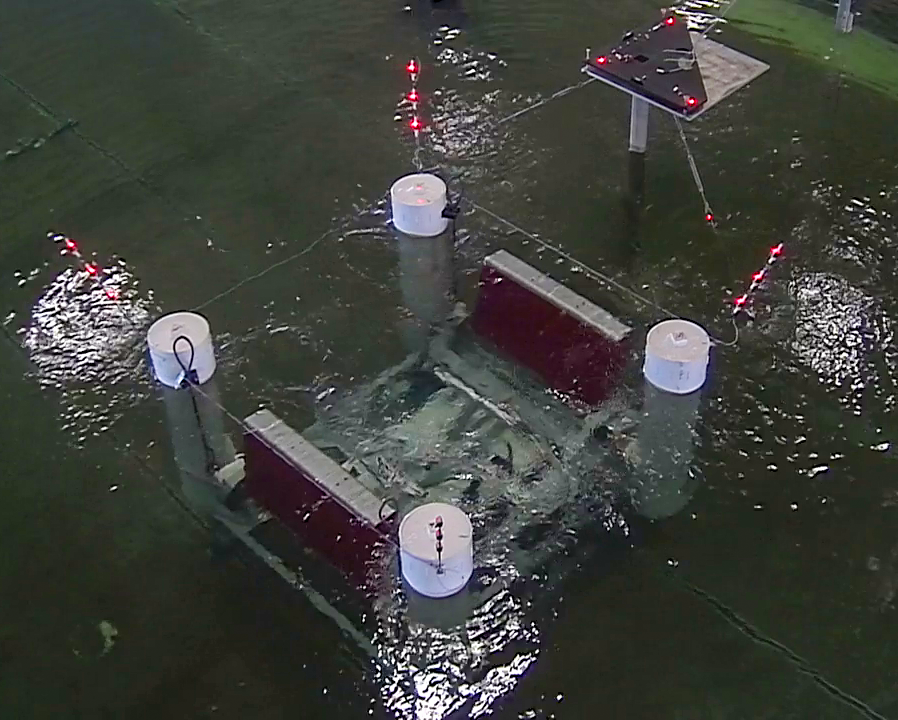
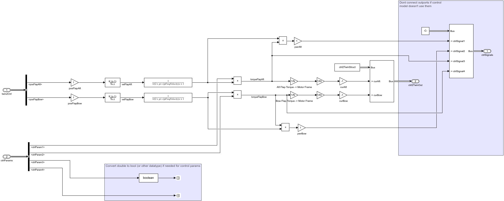
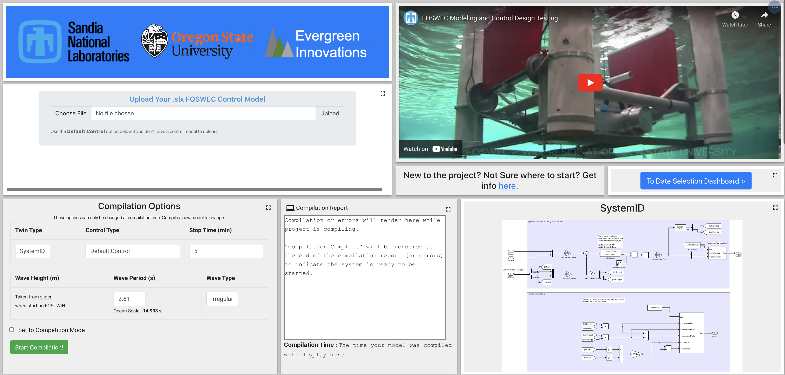
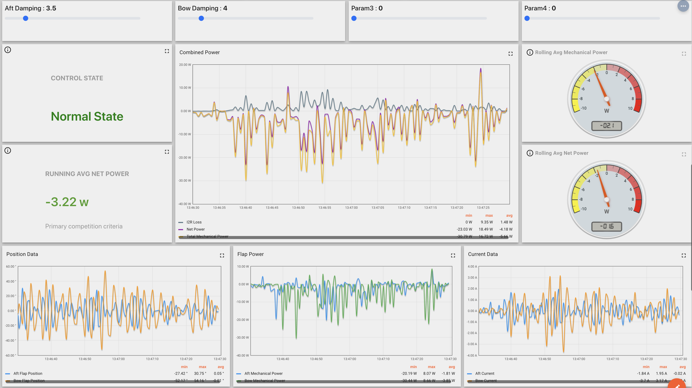

<!-- ## Mask Basin Workshop & FOSTWIN Digital Twin omit in toc -->

Develop a controller for a digital twin of the [FOSWEC](https://energy.sandia.gov/foswec-testing-helps-validate-open-source-modeling-code/) device.
The goal of this controller will be to generate the ***most net power*** while running on a ***real-time digital twin***. The net power is the absorbed mechanical power, less the winding losses in the motors. The competition will focus on the FOSWEC v2 device tested at the [OSU O.H. Hinsdale Wave Research Laboratory](https://engineering.oregonstate.edu/facilities/wave-lab).
The top 5 net power producing controllers will be selected based off data produced and gathered during the simulation and the developer will be awarded bragging rights and up to $2,000 in travel expense reimbursement for attending the [MASK Basin](https://www.defense.gov/Multimedia/Photos/igphoto/2001207018/#:~:text=The%20Navy's%20Indoor%20Ocean%20%2D%2D,Carderock%20Division%2C%20located%20in%20Maryland.) Workshop in **September 2023**.

### Background material

 - [FOSWEC v2 YouTube video](https://youtu.be/OUxbaEC2K6Y)
 - [FOSWEC v2 testing report](https://doi.org/10.2172/1717884)
 - [FOSWEC v2 journal paper](https://doi.org/10.1016/j.energy.2021.122485)

### Competition timeline

| Event | Date |
|---|---|
| Competition kick off | September 06, 2022 |
| [Motion and Vibration Control (MoViC 2022)](https://ifacms-movic2022.seas.ucla.edu/home/) info session | September 7-9, 2022 |
| [OREC/UMERC+METS](https://pacificoceanenergy.org/orec/) info session | September 13-15, 2022 |
| Drop in session with development team | November 7th, 2022, 9:00 AM MT | 
| In-person PMEC workshop at Oregon State | Winter 2022/2023 |
| Final submissions due | June 16th, 2023 |
| MASK Basin workshop | September 2023 |

### Goals of Competition <!-- omit in toc -->

1. Connect motivated WEC developers with industry leaders and researchers
2. Build experience with developing **real-time** controllers to produce **net power** (electrical, or other useful work) in WEC devices
3. Extend on content from the [2019 PMEC Workshop](https://www.energy.gov/eere/water/events/integrated-wec-design-theory-and-practice-workshop) (video below of PMEC Workshop) and learn about the FOSWEC device
4. Acquire knowledge about WEC modeling and simulation in working with the [FOSTWIN](https://github.com/PMEC-OSU/FOSTWIN) open source repository
5. Learn from Sandia WEC experts and the NAVY about developing System Identification (SID) methods from large scale testing to improve WEC modeling
6. Deepen understanding of digital twin techniques between the [WECSim](https://wec-sim.github.io/WEC-Sim/master/index.html) and [System Identification](https://github.com/PMEC-OSU/FOSTWIN#system-identification-model) digital twins available in the interface.
 
<iframe width="560" height="315" src="https://www.youtube.com/embed/OUxbaEC2K6Y" title="YouTube video player" frameborder="0" allow="accelerometer; autoplay; clipboard-write; encrypted-media; gyroscope; picture-in-picture" style="width:100%;" allowfullscreen></iframe>

### Competition award

Everyone who participates in this competition will have the opportunity to advance their WEC modeling and controller skills through the events leading to the [competition submission date](#competition-timeline). The developers of the top 5 controllers will be awarded up to $2,000 in travel expense reimbursement to attend the [**MASK Basin workshop**](https://www.defense.gov/Multimedia/Photos/igphoto/2001207018/#:~:text=The%20Navy's%20Indoor%20Ocean%20%2D%2D,Carderock%20Division%2C%20located%20in%20Maryland.) in **September 2023**.
Through the final workshop, and the events leading up to the competition submission date, participants and awardees will meet industry leaders and WEC experts from Sandia, Oregon State University, and the NAVY (just to name a few) to grow their wave energy network.

At the workshop, the winning developers will participate in a large scale tank testing campaign of the [Sandia WaveBot](https://www.youtube.com/embed/c4npWk_-Pjk).
In doing so, the awardees will learn in-depth details about tank testing of WEC devices to validate System Identification modeling techniques.
In addition to the measurements collected and the numerical methods used in the system identification validation, the awardees will gain hands-on experience with the tools, sensors, and methodology used to measure forces exerted on and throughout the WEC.  

<iframe width="560" height="315" src="https://www.youtube.com/embed/c4npWk_-Pjk" title="YouTube video player" style="width:100%;" frameborder="0" allow="accelerometer; autoplay; clipboard-write; encrypted-media; gyroscope; picture-in-picture" allowfullscreen></iframe>

## Steps to participate
To participate in the competition, there's just a few steps you'll need to take:

1. Enroll in the FOSTWIN control competition [here](https://fostwin-signup.evergreeninnovations.co/)
2. Get familiar with the FOSWEC Digital Twin and the associated web interface
3. Develop a custom controller as a Simulink model & run in real-time through the provided web platform
4. Collect & submit your results from the real-time simulation(s)

To participate in this competition, you must have a few pre-requisites:

- Valid [MATLAB](https://www.mathworks.com/products/matlab.html) license 
- Valid [Simulink](https://www.mathworks.com/products/simulink.html) license
- (Optional) Valid [Simscape](https://www.mathworks.com/products/simscape.html) license and [Simscape Multibody](https://www.mathworks.com/products/simscape-multibody.html) license - **Only required if wanting to work with the WECSim twin in local development**

### Getting familiar <!-- omit in toc -->

To aid both the WEC development community and new users interested in learning about real-time control of digital twins, we've created this [open source repository](https://github.com/PMEC-OSU/FOSTWIN). The repo contains all code and instructions needed to run a FOSWEC digital twin simulation and a provided simple controller locally. You can then develop your enhanced custom controller locally. Via a web interface, you can upload your custom controller and have it execute in real-time on our remote Speedgoat set up. This gives you the opportunity to test the real-time behavior of your code, without requiring your own real-time hardware.

To set the open-source code into context, we plan to host a variety of public workshops to provide information about real-time dynamics modeling, developing controllers for real-time applications, and point out the challenges and benefits of using real-time controllers with digital twins.

### Developing a custom controller <!-- omit in toc -->

We've provided an example controller that users can take as a starting point. This example controller implements a very simple velocity-proportional damping term:
 
|  | 
| :--: |
| *Default controller.* |

The damping settings for this controller can be adjusted live (as the simulation is running) via the web interface: 

We encourage users to try this right away - [an account to the web interface](https://fostwin-signup.evergreeninnovations.co/) can be active within minutes.

Using our simple controller example as a starting point, you can develop your custom controller. This can be done entirely locally (on your own PC), and tested in real-time mode via our web interface. One unique benefit of real-time mode is the ability to change controller tuning parameters while the model is running. Via the web platform you can experiment with different values for tunable parameters like the damping setting applied.

While working with the web interface, you'll get charts of the data flowing throughout the system. You can also to download your simulation results for subsequent post-processing in MATLAB.

### Collect results and submit <!-- omit in toc -->

You must submit your entry as two files:

- the `.mat` file containing the results of running you controller on the digital twin (via the web-based interface)
- the `.slx` file for your controller

Details concerning the submission process will be updated here closer to the competition close.

